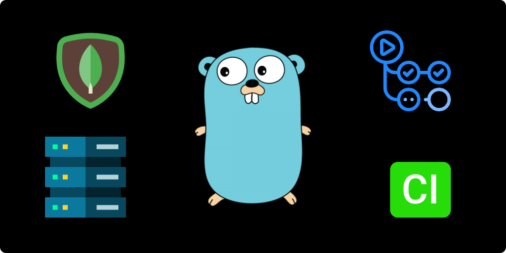

# go-mongodb
The all-in-one guide for using Mongodb with Go.



## Introduction
The repository is a sand-box that illustrates the usage pattern of Mongodb in Go using the [go-mongo](https://github.com/mongodb/mongo-go-driver). The code is structured in a way making it easily pluggable with **clean/onion/hexagonal architecture.**
The purpose of creating this sand-box is

- minimal dependency of business logic implementation on Mongodb and mongo-driver.
- proper implementation of singleton client and its usage across the app.
- solid unit testing of db queries in a concurrent environment.
- easy migration of db layer if required.

## Folder specs
- **.github** - contains action workflows and repository assets.
- **config** - manages application configuration and environment variables.
- **entity** - contains entities of all logical constituents.
- **random** - functions to generate random data like string, integers, etc.
- **repository/mongo** - implementation of mongo client, CRUD ops on all entities, unit testing of all CRUD functions.

## A note on update operation
If you have noticed, instead of updating specific fields, the `updateOne()` function takes the complete updated entity and replaces it against a given matching parameter.
<br><br>
This is useful as it
- makes update operation consistent
- independent of any kind of persistence implementation(Sql, NoSql, Message-Ques, Cache).
- can handle updates on a large number of fields simultaneously.
- compatible with event-driven architectures.

## Using UUID instead of ObjectID.
I have chosen to use UUID as slug instead of objectID as it is only native to Mongodb and adds lots of conversion and validation related code. Using UUID makes all this excess code disappear.

## Testing on CI
Following github action lints the source code and run unit tests.
```yaml
name: mongodb CI

on:
  workflow_dispatch:

jobs:
  ci:
    name: CI
    runs-on: ubuntu-latest

    services:
      mongodb:
        image: mongo
        env:
          MONGO_INITDB_ROOT_USERNAME: root
          MONGO_INITDB_ROOT_PASSWORD: rootpassword
        ports:
          - 27017:27017

    steps:
      - name: Checkout code
        uses: actions/checkout@v2

      - name: Set up Go
        uses: actions/setup-go@v2
        with:
          go-version: 1.15

      - name: install dependencies
        run: |
          make install
          go get golang.org/x/lint/golint

      - name: Lint code
        run: |
          make lint

      - name: Test code
        run: |
          make test
```

## Running tests parallelly
```go
t.Parallel()
```
the above snippet makes the enclosing test function in a separate go-routine.

## References
[passing-data-to-goroutines](https://stackoverflow.com/questions/40326723/go-vet-range-variable-captured-by-func-literal-when-using-go-routine-inside-of-f)

## Author
**Akshit Sadana <akshitsadana@gmail.com>**

- Github: [@Akshit8](https://github.com/Akshit8)
- LinkedIn: [@akshitsadana](https://www.linkedin.com/in/akshit-sadana-b051ab121/)

## License
Licensed under the MIT License